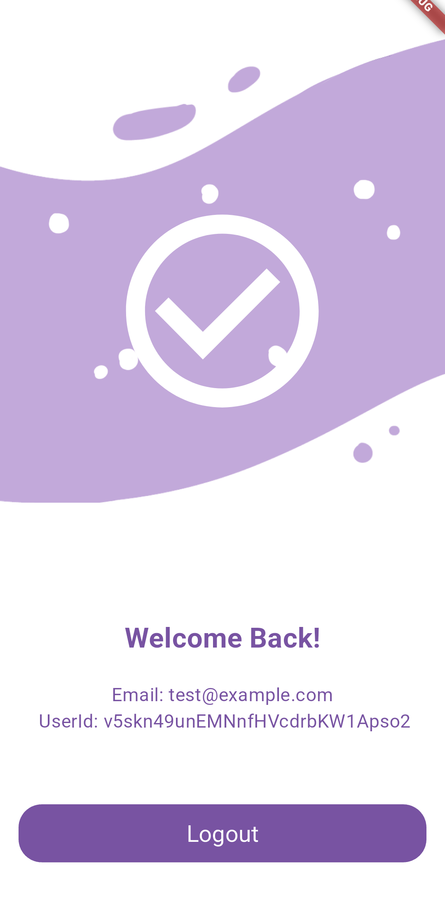

# Flutter Firebase Login App

## Objective

The goal of this project is to build a Flutter application that enables users to log in using Firebase Authentication and includes a unit test for the authentication logic.

## Screenshots

Below are some screenshots of the app:

<p align="center" style="display: flex; flex-wrap: wrap; justify-content: center;">
    
    
    
</p>

## Features

### Flutter App Setup

- **Project Creation**: Initialize a new Flutter project.
- **Firebase Integration**: Integrate Firebase Authentication into the Flutter app.

### User Authentication

- **Email/Password Login**: Implement email and password login functionality using FirebaseAuth.
- **Login Screen**: Create a simple login screen with fields for email and password, and a login button.
- **Feedback Messages**: Display success messages upon successful login and error messages on login failure.

### Unit Testing

- **Authentication Logic Test**: Write a unit test to ensure the authentication logic (e.g., `signInWithEmailAndPassword`) is executed correctly.
- **Mocking**: Use `mockito` or `mocktail` to mock FirebaseAuth during testing.

### Bonus Features

- **State Management**: Implement state management using Riverpod, Bloc, or another preferred approach.
- **Logout Functionality**: Add a simple logout button to the app.

## Evaluation Criteria

- **Clean Code Structure**: Ensure the code is well-organized and follows best practices.
- **Firebase Authentication**: Properly utilize Firebase Authentication for user login.
- **Unit Testing**: Include a working unit test with mocked authentication to verify the login logic.


## Running Unit Tests

To generate the required files for unit testing, run the following command:

```sh
dart run build_runner build
```

## Areas for Improvement

While the project achieves its primary objectives, there are several areas where it could be improved:

### Enhanced UI/UX

I would have liked to add swipe animations when navigating from the login to the success/failure screens in a way that the banner images flowed smoothly.

### Logging

There is very minimal to almost no logging in this project. This can negatively affect the debuggin experience when building new features in the future.

### Code Quality

I'd like to add comprehensive documentation to the codebase to make it easier for other developers to understand and contribute.

### Testing

I would improve testing by adding Widget tests. Widgets like the LogoutButton have cimplexity within them that should be tested properly.

### Side-Hustles

I would like to do this project using a difference design pattern than the BloC aproach used here. There is room for growth in exploring Riverpod, provider and even the BloC package.

By addressing these areas, the project can be made more robust, user-friendly, and maintainable.